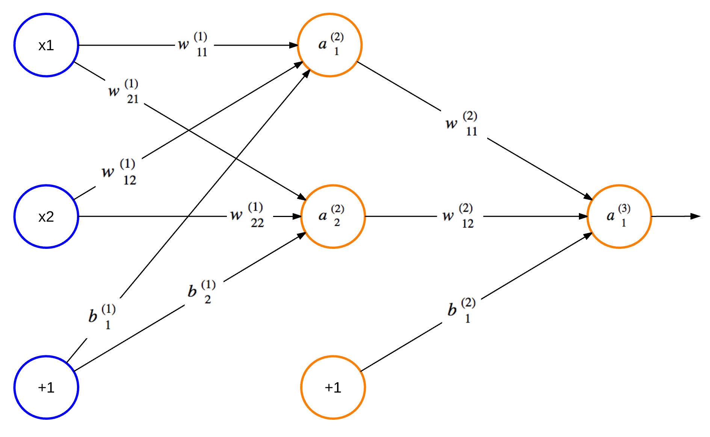

# Optical Character Recognition (OCR)

这是[开源程序架构](http://aosabook.org/en/index.html)系列的第四本[《500 Lines or Less》](https://github.com/aosabook/500lines/blob/master/README.md)的早期章节。
如果你发现任何问题，可以在我们的[Github Issues](https://github.com/aosabook/500lines/issues)上反馈。
请关注[AOSA blog](http://aosabook.org/blog/)获取最新的章节及出版计划，还可以在[这个推特](https://twitter.com/aosabook)上获取关于本书的最新消息。

----
## 简介

要是你的电脑能帮你洗盘子，洗衣服，做饭，收拾房间那会是怎样一番景象呢？
我想我可以确定的说，大多数人会很高兴有这样一个得力的助手！
但是，计算机如何才能确切的按照人完成这些工作的方式，来完成这些任务呢？

著名的计算机科学家艾伦·图灵提出了图灵测试。
这是一种用来判断一台机器的是否已经具有与人类的智力相仿水平的智能的测试。
这个测试包括一个提问者，两个个隐藏的实体（一个人和一台机器）。
提问者需要提出问题并试图通过回答来分辨出哪一个是人，哪一个是机器。
如果提问者是无法辨别机器和人类，那么说明被测试的机器已经具有了与人类相仿水平的智能。

虽然关于‘图灵测试’的有效性以及人们能否创造出这种水平的智能一直有着很多争议，
但是毋庸置疑的是现在已经存在了一些具有不俗智能的机器。
如今一些软件已经可以操控机器人完成简单的办公任务，或者帮助那些爱滋海默症（老年痴呆）的患者。
还有一些更常见的人工智能，像谷歌的搜索引擎以及Facebook的热点推荐系统等等。 

一个众所周知的人工智能的应用是光学字符识别（OCR）。
OCR系统可以识别手写的文字，并且将其转换成机器可以处理的字符。
当你将一个手写支票导入银行设备中验证存款金额时，你可能不会去纠结在后台运行着哪些有趣的工作。
本章将讲解一个基于智能神经网络的（ANN）的数字识别OCR系统。

在开始一切工作之前，我们还要明确一些背景知识。

## 什么是人工智能

尽管图灵关于智能的定义啃起来很合理，但是关于智能的构成，归根结底是一种哲学层面的思索。
计算机科学家们已经（无论是怎么分的）将一些系统和算法分类到人工智能的某些分支当中。
关于这些分类，我们举几个例子（当然还有[更多](http://www-formal.stanford.edu/jmc/whatisai/node2.html)）：

* 根据真实世界已知信息进行的概率性演绎推理。例如：模糊推论法可以帮助恒温器在感知到空气温热潮湿时做出打开空调的决定；
* 启发式搜索。例如：在下棋时可以通过搜索所有可能的来选择出获益最高的走法；
* 反馈的机器学习模型。例如：一些模式识别问题，像OCR。

总之，机器学习就是使用大量数据进行模式识别系统的训练。
用于训练的和数据集可能有两种：一种是示踪的，也就是说根据输入限定系统的期望输出；
一种是非示踪的，也就是说对系统的期望输出没有限制。
使用非示踪数据集的算法被称作非监督式算法，使用示踪数据集的算法则被称作监督式算法。
可以用来实现OCR的机器学习算法核技术有很多，ANNs就是其中一种很简单的方法。

## 人工神经网络（ANNs）

### 什么是ANNs

人工神经网络是一种由很多相互连通且可以互相通讯的节点组成的结构。
这种结构和功能是受到了生物脑结构的启发。
[赫布理论](http://www.nbb.cornell.edu/neurobio/linster/BioNB420/hebb.pdf)解释了神武体内的这些神经网络是如何通过改变物理层面的结构和连接强度来进行模式识别的学习。
同样的，一个典型的ANN（如图13.1所示）的节点之间具有一些会根据网络的学习不断改变权值的连接（边）。
我们称节点标记+1为偏移。
最左边蓝色的一列节点是输入节点，中间一行包含很多隐藏节点，最右边的是输出节点。
中间包含很多隐藏节点的这一列，通常别叫作“隐藏层”。

在图13.1中所有节点圆圈中的数字代表节点的输出。如果我们称第L层第n个节点的输出为n(L),第L层第i个节点与第L+1层第j个节点的链接称为。那么，的输出为：

The values inside all of the circular nodes in Figure 13.1 represent the output of the node. If we call the output of the nnth node from the top in layer LL as a n(L)n(L) and the connection between the iith node in layer LL and the jjth node in layer L+1L+1 as w(L)jiwj(L)i, then the output of node a(2)2a2(2) is: